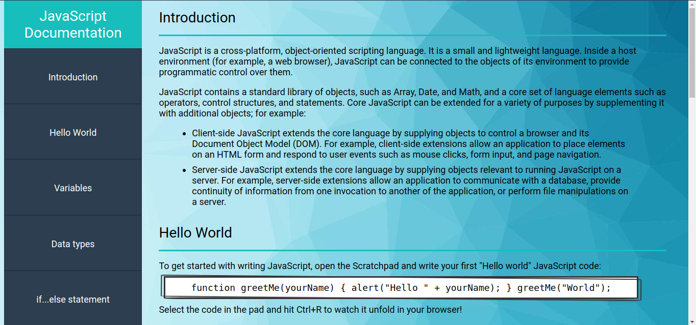

# Build-a-Technical-Documentation-Page
Build a Technical Documentation Page for free code camp

# Technical Documentation Web Page

This project involves creating a technical documentation web page with a main content area (`#main-doc`) and a navigation menu (`#navbar`). The web page should meet the following criteria:

## Main Content Area

The `#main-doc` element should contain at least five `section` elements, each with a `class` of `main-section`. Each `section` element should have a `header` element that describes the topic of the section. Additionally, each `section` element should have an `id` attribute that corresponds to the text of the header with underscores replacing spaces.

Each `main-section` element should contain:

- At least ten `p` elements
- At least five `code` elements
- At least five `li` elements

## Navigation Menu

The `#navbar` element should contain:

- One `header` element that describes the topic of the technical documentation
- Link elements (`.nav-link`) with text that corresponds to the header text within each `section` element

The `header` element in the `#navbar` must come before any link (a) elements in the navbar.

When a user clicks on a `.nav-link` element, the page should navigate to the corresponding section within the `#main-doc` element.

## Display and Style

The `#navbar` element should always be visible on the left side of the screen for regular-sized devices. The page should use at least one media query.## Live Preview

To see a live preview of the technical documentation web page, visit [this link](https://successfulfadwa.github.io/Build-a-Technical-Documentation-Page/).

To complete the project, fulfill the user stories and pass all the tests. Feel free to add your personal style to the page. Happy coding!

